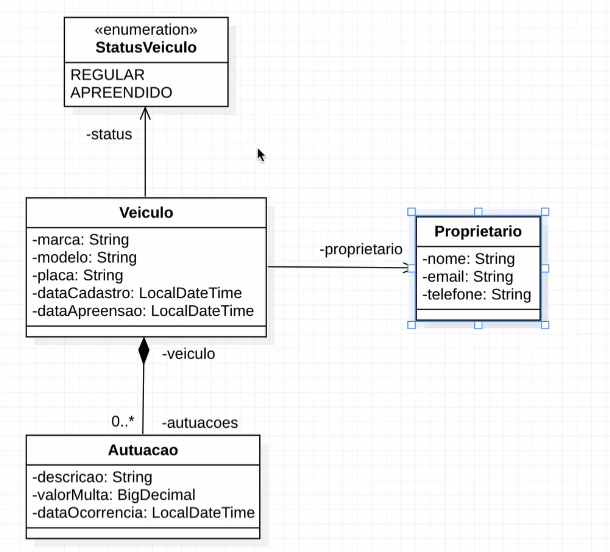

# full-java-modelo
Sistema fullstack simplificado para gerenciamento de autuação de veículos

### tecnologias
- backend: java 25 e spring boot 4.0.3
- frontend: html / css-tailwind / javascript / node-typescript

### diagrama de classes

