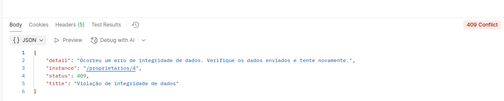

# full-java-modelo
Sistema fullstack simplificado para gerenciamento de autuação de veículos

- créditos da API: Curso Algaworks (Instrutor: Thiago Faria)

### tecnologias
- backend: java 25 e spring boot 4.0.3
- frontend: html / tailwind css v4 / typescript / vite
- Banco de dados: MySQL com FlyWay (ferramenta de migracão de banco de dados que gerencia alterações no esquema /estrutura de bancos relacionais de forma versionada e controlada)

### como executar

#### backend (`back/`)

```bash
./mvnw spring-boot:run
```

#### frontend (`front/`)

```bash
npm install
npm run dev
```

O frontend usa proxy `/api` no Vite para conversar com o backend em `http://localhost:8080`.

### diagrama de classes


### boas práticas
- divisão de responsabilidade entre as classes
- lombok para equals e hashcode com include apenas no atributo ID 
- Capturando exceções globais com @RestControllerAdvice

- @JsonProperty(access = Access.READ_ONLY:
* Na serialização: esses campos aparecem no retorno da API.
* Na desserialização: se o cliente mandar esses campos no body da requisição, o Jackson ignora. 

O motivo faz sentido para esse domínio: são campos controlados pelo servidor, não pelo cliente. Por exemplo, o cliente pode informar marca, modelo, placa e proprietário, mas não deveria definir sozinho se o veículo está APREENDIDO ou qual foi a data de cadastro.

Funciona como uma proteção extra, porque o cadastro já recebe um DTO em vez da entidade diretamente, no método VeiculoController.java, usando VeiculoDTO.java. Como esse DTO não possui status, dataCadastro e dataApreensao, o cliente já não consegue enviar esses campos por esse endpoint. Então o @JsonProperty está mais como uma regra de segurança e intenção da entidade caso ela venha a ser serializada ou desserializada diretamente em outro ponto.


- dto (Isolando o Domain Model do Representation Model)
- Mostra conflito quando tenta excluir  1 proprietário que está vinculado a 1 veículo


- OffsetDateTime para mostrar a hora local independente da região


### regras de negócio implementadas
- atualização de email bloqueada para um email que já exista com uso do @ExceptionHandler, retorna status 400 e mensagem personalizada
- data de apreensão do veículo pode ser null no banco de dados, pois na maior parte dos casos o veículo não será apreendido
- apenas 1 unico registro de placa, configuração no banco de dados e na API
- validação em cascata e groups(@ConvertGroup), com validação do formato da placa do veículo (@Pattern)
- modelagem do recirso de autuacao como um subrecurso de veiculo, pois a autuacao somente existirá se estiver atrelada a um veiculo e esse veiculo existir
  localhost:8080/veiculos/1/autuacoes

28/03/26
### modelando ações não-CRUD
- Não é obrigatório as entidades que representam a API serem as mesmas do modelo de domínio. Sendo assim, criou no postman o PUT - Veiculos - Apreender, endpoint (localhost:8080/veiculos/1/apreensao), usou o PUT em vez do POST, pois o PUT É idempotente (significa que realizar a mesma requisição PUT várias vezes seguidas produz o mesmo resultado no servidor, sem efeitos colaterais adicionais)   
- Também criou o recurso para remover a apreensao
DEL (localhost:8080/veiculos/1/apreensao)